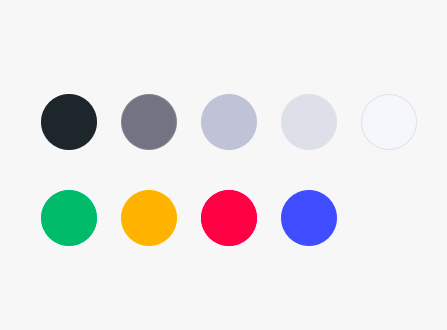

# **Kiwi Kit**

Reading list:

- [TypeScript](https://www.typescriptlang.org/) (Provides living documentation)
- [TSDX](https://github.com/jaredpalmer/tsdx) (CLI for TypeScript packages)
- [Atomic Design](http://atomicdesign.bradfrost.com/) (Methodology for crafting design systems)
- [Styled System](https://styled-system.com/) (Used to build `quarks`)
- [React Use](https://github.com/streamich/react-use) (Lodash for React Hooks)

## **How to use in your repo**

**If someone in your project previously added kiwi/core to dependecies you need to do just steps 2, 3 and 4 to be able to install dependecies via npm.**

1. Add .npmrc into your repository and paste in this file `registry=https://npm.pkg.github.com`
2. You need to create [Github Access Token](https://github.com/settings/tokens) with correct permissions: `repo`, `write:packages` and `read:packages` (first 3 checkboxes) - copy the generated token
3. In the repository where you want to use Kiwi Kit you need to do login to npm. To do so type: `npm login --registry=https://npm.pkg.github.com`.
4. Then it will ask for:

- Username: _github username_
- Password: _generated github access token_
- Email: _your public email address (github email address)_

5. Add kiwi/core to your package.json like `"@kiwijobs/core": "0.0.5",`

After these five steps you can do install packages with npm.

Helpful Links:

- [Creating a presonal access token for the command line](https://help.github.com/en/github/authenticating-to-github/creating-a-personal-access-token-for-the-command-line)
- [Configuring npm for use with github packages](https://help.github.com/en/github/managing-packages-with-github-packages/configuring-npm-for-use-with-github-packages)

## **Theme**

### **Colors**



_From left to right: 1, 2, 3, 4, 5, primary, tangerine, pink, secondary_

There is a handful of utititiles for using colors from our `theme`.

There is a set of basic colors that are used for texts and backgrounds. They are defined in an array of `strings`.
For example, standard text should have a color `1`.

We also have a few basic colors (`primary`, `secondary`, `dark` etc.) that can be lightened (ex. `"primary.150"` will be 50% brighter than baseline) or darkened (ex. `"primary.50"` will be 50% darker than baseline). There is a whole spectrum between `0 - 200` where `0` is pure black and `200` is pure white.

### **z-indexes**

**100** - Nav  
-  
-  
-  
**500** - Dialog  

## **Components**

### **Grid layout**

Base components for creating layouts.

- **`Container`** - provide a means to center and horizontally pad your app’s contents. Comes with specified `max-width` that includes default `gutter` paddings.
- **`Row`** - Rows are wrappers for columns. Each column has horizontal padding (called a `gutter`) for controlling the space between them. This padding is then counteracted on the rows with negative margins. This way, all the content in your columns is visually aligned down the left side. Only `columns` may be immediate children of rows.
- **`Col`** inherit it's `gutter` from parent `Row`. It accept all `styled-system` props (_cought_ `width`) instead of predefined `12` or `24` magical numbers presented in bootstrap or material ui.

#### Example

```
<Container>
  <Row>
    <Col width={0.5}> ... </Col>
    <Col width={1/2}> ... </Col>
  </Row>
  <Row>
    <Col width={6/12}> ... </Col>
    <Col width={12/24}> ... </Col>
  </Row>
  <Row>
    <Col width="calc(50% - 300px)"> ... </Col>
    <Col width="300px"> ... </Col>
  </Row>
  <Row>
    <Col width={[1, 0.5, 0.75]}> ... </Col>
    <Col width={[1, 0.5, 0.25]}> ... </Col>
  </Row>
</Container>
```

### **Loader**

`Loader` component with three variants `DEFAULT` _(bluish)_, `LIGHT` and `DARK`.
Comes with predefined `absolute` set to `true` that is used to center him inside it's closest parent with `position:relative;`
